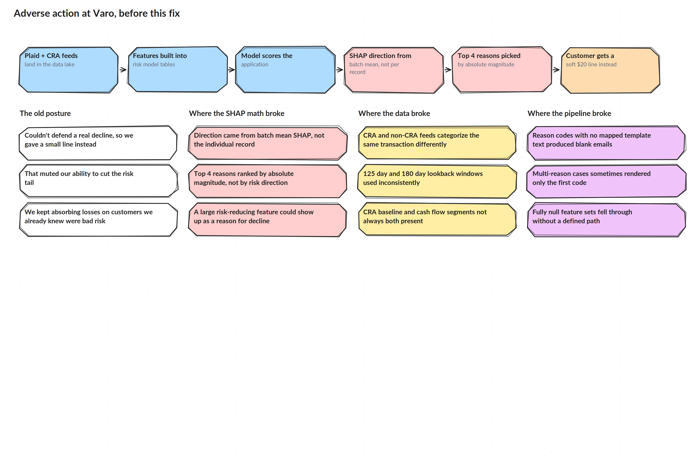

# The Problem

## Where this sat in the lending flow

VA Day Zero and VA Classic score an applicant, decide whether to approve, decline, or cut a line, and then, if it is not a clean approval, have to tell the customer why. That last step is adverse action under the Fair Credit Reporting Act. The reasons on that letter have to trace back to real, specific drivers of the decision, not a generic explanation.

The pipeline behind it: Plaid transaction data plus CRA cash flow data plus internal banking behavior gets built into features, a model scores the applicant, a policy layer decides eligibility, pricing, and line size, and SHAP explains which features drove that score. The top drivers become the reason codes on the letter, and a compliance quality gate is supposed to catch anything before it goes out.

## The old posture

Before this work, the team could not fully trust the reasons the pipeline was producing. Rather than risk a decline it could not defend, the fallback was often a small dollar line, something like a $20 limit, instead of an actual denial. That protected against a bad reason code showing up on a real letter, but it also meant real risk sat on the book that should have been declined outright, and pricing never got the chance to reflect the risk that was actually there.

## Where the SHAP math broke

Two bugs sat at the center of this.

**Direction.** The code that decided whether a feature was increasing or decreasing an applicant's risk was computed from the mean SHAP value across a batch, not from that specific applicant's own signed SHAP value. That meant a feature could get labeled as increasing risk for someone whose individual SHAP contribution actually ran the other way. A reason code built on that basis does not describe what actually happened to that customer.

**Selection.** The top four reasons for a letter were picked by the absolute size of the SHAP value, not by its sign. That let a large risk reducing feature show up as a reason for a decline, which does not make sense to a customer and does not hold up under compliance review.

## Where the data broke

Plaid's CRA feed and its non-CRA feed categorize the same kind of transaction differently. Something that looks like rent in one feed can look like a loan payment in the other, which changes feature counts depending on which feed produced them. On top of that, CRA and non-CRA pulls used different lookback windows, 180 days against 125 days, and nothing forced them onto the same standard before scoring. CRA data itself splits into a baseline segment and a cash flow segment, and both were not always present or used together, which meant some applicants got scored on a partial view of their own data without anyone noticing.

## Where the pipeline broke

Downstream of the model, a few reason codes that could come out of the SHAP step had no matching template text, which produced blank or half filled sections of a letter. When a decision carried more than one reason, the rendering step sometimes only wrote out the first one and silently dropped the rest. And applicants with a fully null feature set, meaning there was no usable lookback data at all, had no defined path, so they could fall through the pipeline instead of getting an honest insufficient information response.
