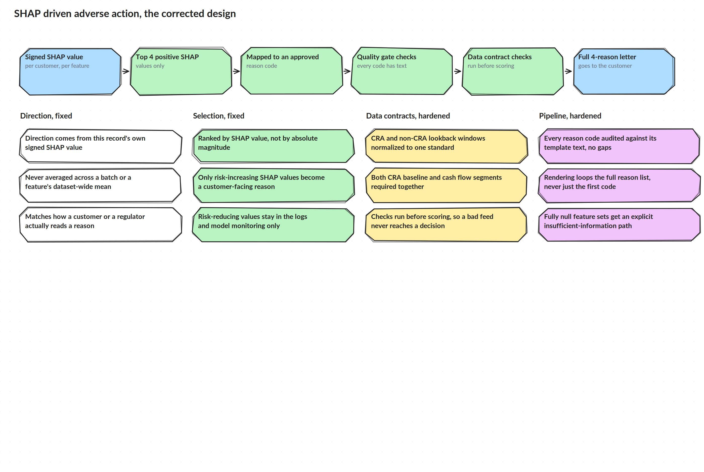

# The Fix

## Direction, fixed

Direction now comes from each record's own signed SHAP value, never from a batch mean or a feature's dataset wide average. If a feature helped a specific applicant, that applicant's letter has to say so, and if it hurt them, it has to say that instead. Averaging across other people's data was never going to produce the right answer for the person actually reading the letter.

`src/shap_aa/direction.py` keeps both versions side by side on purpose: `batch_mean_direction()` is the old approach, kept so the difference is visible and testable, and `per_record_direction()` is what the pipeline actually uses now.

## Selection, fixed

Reasons are now ranked by the SHAP value itself, not by its absolute size, and only risk increasing values are eligible to become a customer facing reason. A feature that reduced someone's risk should never show up as a reason they were declined. Risk reducing SHAP values still get written to logs and model monitoring, they just never reach a letter.

`src/shap_aa/reason_selection.py` has `select_top_positive_reasons()` for the fixed behavior and `select_top_absolute_reasons()` kept alongside it for the same reason, to make the bug demonstrable and testable rather than just described.

## Data contracts, hardened

CRA and non-CRA lookback windows are normalized to one expected standard instead of silently diverging, 180 days for both CRA segments and 125 for the non-CRA feed, checked explicitly rather than assumed. Both the CRA baseline segment and the CRA cash flow segment are now required together, so an applicant never gets scored on half a picture without anyone noticing. These checks run before scoring, not after, so a bad feed gets caught before it can shape a decision.

`src/shap_aa/data_contracts.py` holds the expected lookback windows and the checks that run against them.

## Pipeline, hardened

Every reason code that can come out of the model now has to have matching template text, checked by a quality gate that fails loudly instead of letting a blank section reach a customer. Rendering always walks the full list of reasons for a decision, so a multi reason letter never quietly drops down to just one. Applicants with a fully null feature set get an explicit insufficient information response instead of falling through undefined.

`src/shap_aa/templates.py` holds the reason code catalog, the quality gate, and the rendering logic. `src/shap_aa/pipeline.py` is where all of this ties together: a decision only becomes a letter after it clears both the data contract checks and the reason quality gate, and anything that fails either one gets held for a person to review instead of going out incomplete.
