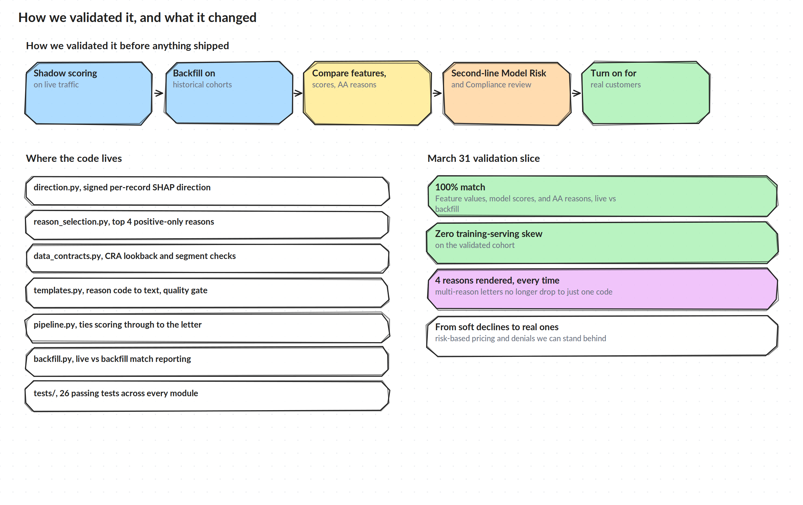

# Validation and Outcomes

## How we validated it before anything shipped

Nothing here went live on the strength of a code review alone.

1. **Shadow scoring on live traffic.** The fixed pipeline ran alongside the existing one on real applications before its output ever reached a customer, so we could see exactly where the two disagreed while there was still zero customer impact.
2. **Backfill on historical cohorts.** We reran the fixed pipeline against historical applicants, most notably a slice from March 31 and the days around it, and compared feature values, model scores, and reason codes between what actually went out and what the fixed logic would have produced.
3. **Model version validation.** VA Classic went through a v3 model change during this same window, and that change was validated through the same backfill approach against performance and governance thresholds before it shipped.
4. **Second line and compliance review.** Model risk reviewed the SHAP distributions, monotonicity, and reason hierarchy directly. Compliance reviewed example letters and the FCRA reasoning behind them. Both signed off before the fix reached real customers.
5. **End to end tests.** A full pass from the customer's application, through the model, through reason selection, to the letter that would have gone out, checked as one connected path rather than as isolated units.

## Where the code lives

- `src/shap_aa/direction.py`, per-record SHAP direction, with the old batch mean approach kept for comparison
- `src/shap_aa/reason_selection.py`, top four positive only reasons, with the old absolute magnitude approach kept for comparison
- `src/shap_aa/data_contracts.py`, CRA lookback window and segment checks
- `src/shap_aa/templates.py`, reason code catalog and the quality gate
- `src/shap_aa/pipeline.py`, the full decision path from applicant to letter
- `src/shap_aa/backfill.py`, the comparison logic behind the shadow scoring and backfill checks
- `tests/`, 26 passing tests across every module above

Run the demo with `python -m shap_aa.cli` from the `src` directory. Every applicant in it is synthetic, none of it is real Varo data.

## The March 31 validation slice

- 100 percent match between feature values, model scores, and reason codes, live versus backfill
- Zero training serving skew cases found on the validated cohort
- Every multi reason letter rendered its full set of reasons, none dropped down to one

## What changed

Before this, a real denial the team could not fully defend became a soft $20 line instead. After it, a decline or a line cut comes with reasons that trace back to that specific applicant's own data, checked before they ever reach a letter. That is the difference between avoiding risk by giving everyone a token line and actually pricing and declining based on the risk that is really there.

The same shadow scoring plus backfill plus dual review pattern is reusable for any future credit or risk model that needs a defensible customer facing explanation, not just this one.
